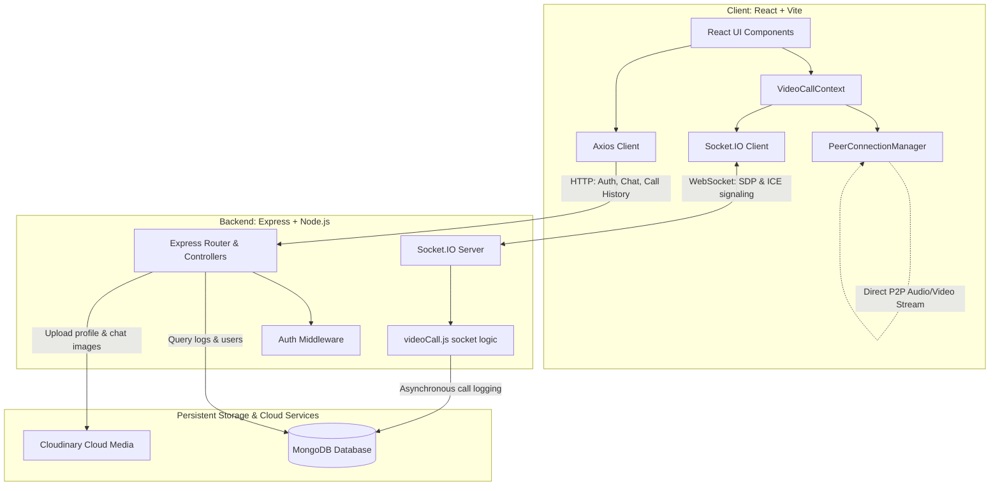

# INSTA-CHAT 💬

INSTA-CHAT is a modern, production-quality, real-time chat and communication platform built using the MERN stack (MongoDB, Express, React, Node.js). It supports instant messaging, media sharing, presence tracking, and peer-to-peer **WebRTC Video Calling** integrated with a persistent **Call History** logs system.

---

## 🏗️ System Architecture

Below is the high-level system architecture of the application, representing the separation between standard REST API endpoints, real-time Socket.IO events, and the Peer-to-Peer (P2P) WebRTC media stream:



---

## 🚀 Features

### 💬 Real-Time Chat & Emojis
- **One-to-One Messaging**: Instant chat message transmission using Socket.IO.
- **Media Support**: Send and share pictures directly in chat tabs using Cloudinary storage.
- **Unread Counter**: Dynamic badges indicating unseen incoming messages from users.
- **Presence Tracking**: Real-time indicator badges showing online/offline presence.
- **Typing Indicators**: Active typing notices ("typing...") sent peer-to-peer.

### 📹 WebRTC One-to-One Video Calling (P2P)
- **Peer-to-Peer Media**: High-quality audio/video streaming directly between browsers.
- **Signaling via Sockets**: Socket.IO acts purely as a signaling channel (exchanging SDP offers/answers and ICE candidates).
- **ICE Candidate Queueing**: Internal queueing systems prevent WebRTC race conditions before remote descriptions are set.
- **Microphone & Camera Toggles**: Live mute/unmute and camera off/on track toggles with responsive overlays.
- **Call State Machine**: Structured state engine managing call lifecycle: `IDLE` ➔ `CALLING` / `RINGING` ➔ `CONNECTED` ➔ `ENDED` ➔ `IDLE`.

### 📞 Call History Logs
- **Persistent Log System**: Persistent database tracking of who called whom, call status, timestamps, and call duration.
- **Status Badges**: Displays Call Logs with color-coded tags indicating `Completed` (duration formatted), `Missed`, `Declined`, or `Failed`.
- **Instant Callbacks**: Quick call button in call logs allowing users to redial directly if the peer is online.
- **Tab Swapping**: Toggle between Chat contacts and Call History logs directly from the sidebar.

---

## 🛠️ Technology Stack

### Frontend
- **Framework**: React 19 (Vite)
- **State Management**: React Context API
- **Styling**: Tailwind CSS v4 & custom glassmorphism
- **Real-Time Client**: Socket.IO Client 4.x
- **HTTP client**: Axios

### Backend
- **Server Framework**: Node.js & Express 5 (ES Modules)
- **Real-Time Server**: Socket.IO 4.x
- **Database**: MongoDB with Mongoose ODM
- **Media Upload**: Cloudinary SDK
- **Security**: JWT (jsonwebtoken) & bcryptjs for password hashing

---

## 📁 Directory Structure

```
INSTA-CHAT/
├── client/                      # Frontend Application
│   ├── context/
│   │   ├── AuthContext.jsx      # Authentication session & Socket connection
│   │   ├── ChatContext.jsx      # Chat logic, sidebar contacts, messages
│   │   ├── ThemeContext.jsx     # Dark & light theme switcher
│   │   └── VideoCallContext.jsx # WebRTC call states & socket signaling listeners
│   ├── src/
│   │   ├── components/
│   │   │   ├── ChatContainer.jsx    # Chat header, message body, input area
│   │   │   ├── SideBar.jsx          # Tab navigation (Chats / Calls) & search
│   │   │   ├── CallHistory.jsx      # Log list with status tags & callback buttons
│   │   │   ├── VideoCallButton.jsx  # Outgoing call camera icon
│   │   │   ├── IncomingCallModal.jsx# Accept/Decline pop-up modal
│   │   │   └── VideoCallWindow.jsx  # Fullscreen remote stream & local preview PIP overlay
│   │   ├── utils/
│   │   │   └── peerConnection.js    # PeerConnectionManager utility class for WebRTC
│   │   └── main.jsx                 # Client entry point wrapped with Context Providers
│   └── package.json
│
└── server/                      # Backend Server
    ├── controllers/
    │   ├── userController.js    # Authentication, registration, user profiles
    │   ├── messageController.js # Sidebar users query, message fetch & mark as seen
    │   └── callController.js    # Fetch call history records
    ├── middleware/
    │   └── auth.js              # Protect route middleware verifying JWT token
    ├── models/
    │   ├── User.js              # User collection schema
    │   ├── messages.js          # Messages collection schema
    │   └── Call.js              # Persistent Call logs schema with indexes
    ├── routes/
    │   ├── userRoutes.js        # Auth endpoint routers
    │   ├── messageRoutes.js     # Chat message routers
    │   └── callRoutes.js        # Call history endpoint routers
    ├── socket/
    │   └── videoCall.js         # Socket.IO event signaling handlers & call sessions
    ├── server.js                # Server bootstrap and Socket.IO initialization
    └── package.json
```

---

## ⚙️ Setup & Installation

### 1. Prerequisites
- [Node.js](https://nodejs.org) (v18+ recommended)
- [MongoDB](https://www.mongodb.com/) (Local or Atlas URI)
- [Cloudinary](https://cloudinary.com/) account credentials

### 2. Backend Configuration
Create a `.env` file in the `server` directory:
```env
PORT=5000
MONGO_URI=your_mongodb_connection_string
JWT_SECRET=your_jwt_secret_key
CLOUDINARY_CLOUD_NAME=your_cloudinary_name
CLOUDINARY_API_KEY=your_cloudinary_api_key
CLOUDINARY_API_SECRET=your_cloudinary_api_secret
```

Install backend dependencies and start the server:
```bash
cd server
npm install
npm run server
```

### 3. Frontend Configuration
Create a `.env` file in the `client` directory:
```env
VITE_BACKEND_URL=http://localhost:5000
```

Install frontend dependencies and start the development server:
```bash
cd client
npm install
npm run dev
```

---

## 🛡️ WebRTC Signaling & Lifecycle Diagram

Below is the structured lifecycle flow of call invitation and peer-to-peer WebRTC connection:

```
 Caller                                  Server                                 Receiver
   |                                       |                                       |
   | --- call-user (Invitation check) ---> |                                       |
   |                                       | --- incoming-call (Modal alert) ----> |
   |                                       |                                       |
   | <--- call-accepted (Accepted!) ------ | <--- call-accepted (Clicked Accept) - |
   |                                       |                                       |
   | ====== Create PeerConnection & Local streams configured ===================== |
   |                                       |                                       |
   | --- offer (SDP description) --------> |                                       |
   |                                       | --- offer (SDP description) --------> |
   |                                       |                                       |
   |                                       | <--- answer (SDP description) ------- |
   | <--- answer (SDP description) ------- |                                       |
   |                                       |                                       |
   | <========= ice-candidate (Direct connection paths exchanged) ==============> |
   |                                       |                                       |
   | <======================= Direct P2P Media Streams ==========================> |
   |                                       |                                       |
   | --- end-call (Hang up) -------------> |                                       |
   |                                       | --- call-ended ---------------------> |
   v                                       v                                       v
```

---

## 💡 Key WebRTC Interview Concepts Implemented

- **WebSockets vs P2P**: Video/audio media is never streamed through Socket.IO. WebSockets are used solely as the signaling channel to negotiate connection profiles (SDPs) and network paths (ICE Candidates). Media streams peer-to-peer via UDP for ultra-low latency.
- **ICE Candidate Queueing**: Solves the classic race condition where ICE candidates arrive from the signaling channel before the browser finishes executing `setRemoteDescription()`. Candidates are queued locally and flushed once the remote SDP description is set.
- **Hardware Lock Prevention**: Whenever a call ends or is rejected, `localStream.getTracks().forEach(track => track.stop())` is executed. This releases camera and microphone hardware resources, preventing the browser camera light from remaining stuck on.
- **Asynchronous DB Handling**: Database updates for logs run asynchronously on socket transitions so that critical real-time signaling network packets are never blocked.
